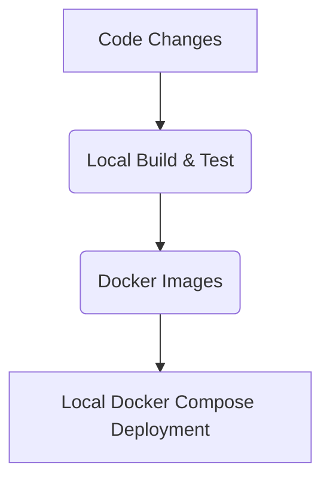

# Deployment Model

This document details the deployment strategy for the project, focusing on local development and testing.

## 1. Infrastructure

The application is designed to be deployed on a local machine using Docker Compose.

- **Compute**: Containerized services running via Docker Compose.
- **Databases**: Local SQLite files (for `validation_tool.ts`) and DuckDB files (for `dagster_project`).
- **File Storage**: A shared Docker volume for persistent storage of uploaded images.
- **Networking**: Docker's internal networking for inter-container communication.
- **Redis**: A Redis container for caching or message brokering.

## 2. Environments

Currently, the primary focus is on the local development environment.

- **Development (local)**:
- Used by developers for local testing and feature development.
- Utilizes Docker Compose for setting up and running all services.
- Data is typically ephemeral, but can be persisted via Docker volumes for convenience.

## 3. Build and Test Process

Our process automates the build and test steps for local development.

1. **Code Changes**: Developers make changes to the codebase.
2. **Local Build & Test**: Docker images are built locally, and automated tests (unit, integration, linting, type checking) are run within the local environment.
3. **Local Deployment**: Services are run via `docker-compose up` for local testing and interaction.

## 4. Current State

- The `docker-compose.yml` currently only defines a Redis service.
- The `validation_tool.ts` (frontend and Express backend) and `dagster_project` (Dagster project) are separate codebases that need to be integrated into the Docker Compose setup.

## 5. Immediate Goals

- Expand `docker-compose.yml` to include all necessary services: `validation_tool.ts` (frontend and backend), `dagster_project` (Dagster webserver and daemon), and Redis.
- Configure a shared Docker volume for file storage.
- Create appropriate `Dockerfile`s for each service.
- Ensure all services can communicate and function correctly within the Docker Compose environment.

## 6. Future Considerations

- **Staging Environment**: Introduce a staging environment that mirrors production for integration testing and UAT.
- **Production Deployment**: Transition to a cloud-based container orchestration platform (e.g., Kubernetes) for production deployments.
- **CI/CD Pipelines**: Implement comprehensive CI/CD pipelines for automated builds, tests, and deployments to various environments.

## Deployment Flow Diagram

