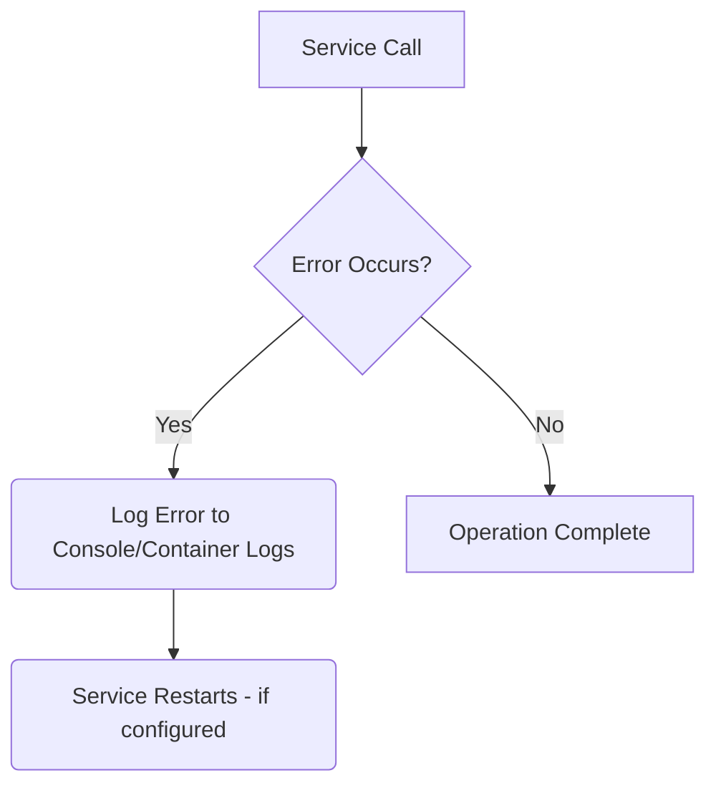

# Error Handling and Resilience

This document outlines the approach to error handling and basic resilience within the local development environment.

## 1. Error Handling Philosophy

- **Fail Fast**: Identify and report errors as early as possible during development to facilitate quick debugging.
- **Informative Errors**: Error messages should be clear and provide enough context for local debugging.
- **Local Logging**: Errors should be logged to the console or Docker container logs for easy access during development.

## 2. Basic Resilience Patterns

For local development, resilience focuses on ensuring services can restart and function correctly.

- **Container Restarts**: Rely on Docker Compose's default restart policies for services that crash, allowing them to recover automatically.
- **Timeouts**: Implement reasonable timeouts for inter-service communication to prevent indefinite hangs during local testing.

## 3. Local Monitoring and Debugging

Monitoring in a local context is primarily for development and debugging purposes.

- **Container Logs**: Use `docker-compose logs` to inspect service output and identify issues.
- **Debugging Tools**: Utilize IDE-integrated debuggers for step-by-step code execution and variable inspection.

## 4. Current State

- Error handling is primarily implemented within individual services (e.g., `validation_tool.ts` Express.js error middleware, Dagster exception handling).
- Logging is directed to standard output, visible via `docker-compose logs`.

## 5. Immediate Goals

- Standardize error response formats across the `validation_tool.ts` API and Dagster APIs.
- Implement consistent logging practices for easier debugging across services.

## 6. Future Considerations

- **Centralized Logging**: Integrate with a centralized logging solution (e.g., ELK stack, Grafana Loki) for production environments.
- **Distributed Tracing**: Implement distributed tracing (e.g., OpenTelemetry) to track requests across multiple services.
- **Advanced Resilience Patterns**: Introduce circuit breakers, retries with exponential backoff, and bulkheads for production-grade fault tolerance.
- **Monitoring & Alerting**: Set up comprehensive monitoring with metrics and alerts for production.

## Error Handling Flow Diagram

