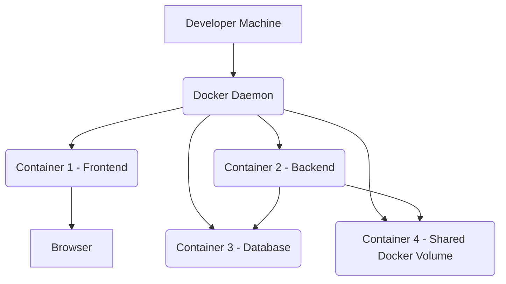

# Scalability and Performance

This document discusses performance considerations for the local development environment.

## 1. Local Performance Principles

- **Resource Efficiency**: Optimize services to run efficiently on a single development machine, minimizing CPU and memory consumption.
- **Fast Startup Times**: Aim for quick service startup times to enhance developer productivity.
- **Responsive UI**: Ensure the local web application remains responsive during development and testing.

## 2. Local Performance Optimization Strategies

- **Efficient Algorithms and Data Structures**: Choose appropriate algorithms and data structures for critical paths to minimize computational complexity, even in a local context.
- **Optimized Database Queries**: Write efficient SQL queries and use proper indexing to ensure local database operations are fast.
- **Minimize Docker Image Size**: Keep Docker images as small as possible to reduce build and pull times.
- **Leverage Docker Caching**: Utilize Docker's build cache effectively to speed up iterative development.

## 3. Local Performance Monitoring and Debugging

Performance monitoring in a local context is primarily for identifying and resolving bottlenecks during development.

- **System Resource Monitors**: Use operating system tools (e.g., `top`, Task Manager) to monitor CPU, memory, and disk usage of Docker containers.
- **Application Profiling**: Employ language-specific profiling tools (e.g., Python's `cProfile`, Node.js Inspector) to identify performance hotspots within individual services.
- **Browser Developer Tools**: Use browser developer tools to analyze frontend performance, network requests, and rendering bottlenecks.

## 4. Current State

- Performance is currently evaluated informally during local development.
- The use of SQLite and DuckDB for local databases generally provides good performance for single-user development.

## 5. Immediate Goals

- Ensure all services run efficiently within the Docker Compose environment without excessive resource consumption.
- Optimize Docker image build times for faster iteration.

## 6. Future Considerations

- **Load Testing**: Conduct load testing to identify performance bottlenecks and validate scalability assumptions for production environments.
- **Horizontal Scaling**: Design services for horizontal scalability to handle increased user traffic and data volume in production.
- **Caching Strategies**: Implement comprehensive caching at various layers (e.g., Redis, CDN) for production performance optimization.
- **Distributed Tracing**: Implement distributed tracing for performance analysis across microservices in production.

## Local Performance Diagram

