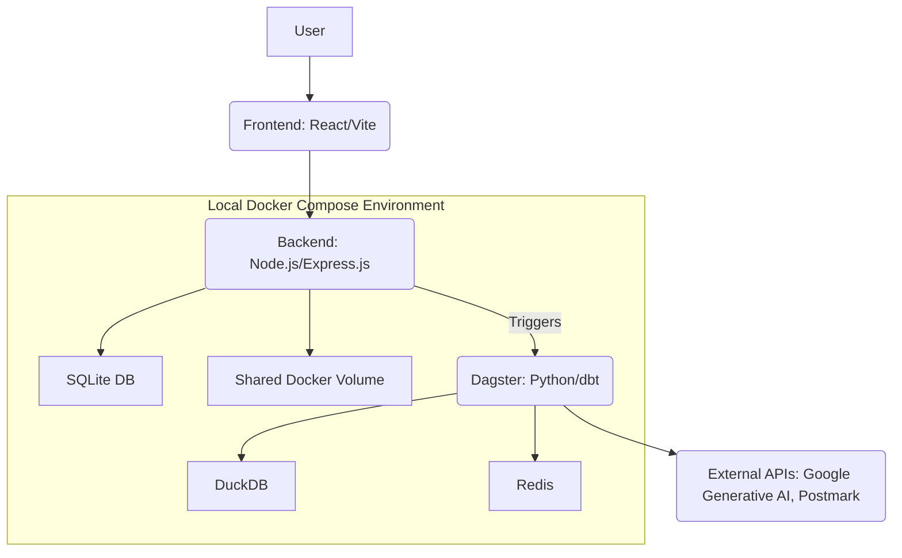

# Technology Stack

This document lists and briefly describes the core technologies and frameworks used in the project, with a focus on local development via Docker Compose.

## 1. Frontend

- **React**: A JavaScript library for building user interfaces, used in `validation_tool.ts`.
- **Vite**: A build tool that provides a fast development experience for the React frontend.
- **TypeScript**: A superset of JavaScript that adds static typing, improving code quality and developer productivity.
- **Tailwind CSS**: A utility-first CSS framework for rapidly building custom designs.

## 2. Backend Services

- **Node.js / Express.js**: The primary backend for the `validation_tool.ts` application, handling API requests and serving the frontend.
- **Python / Dagster**: The core technologies for the `dagster_project` project, used for data orchestration, processing, and automation.
- **Docker**: Essential for containerizing all services, ensuring consistent environments across local development machines.

## 3. Database & Storage

- **SQLite**: A file-based relational database used by the `validation_tool.ts` backend for local data storage.
- **DuckDB**: An in-process SQL OLAP database, used by `dagster_project` via `dbt-duckdb` for data transformation and storage.
- **Redis**: Used for caching or as a message broker, potentially by Dagster.
- **Shared Docker Volume**: For persistent storage of uploaded images, accessible by both `validation_tool.ts` and `dagster_project`.

## 4. Other Tools & Libraries

- **Tesseract OCR**: An open-source OCR engine for extracting text from images.
- **dbt (data build tool)**: Used within `dagster_project` for data transformation and modeling in DuckDB.
- **Google Generative AI**: Integrated into `dagster_project` for advanced data extraction or enrichment.
- **Postmark**: Used by `dagster_project` for sending email notifications.
- **Multer**: Node.js middleware for handling `multipart/form-data`, used in `validation_tool.ts` for file uploads.
- **PDF.js**: A PDF rendering library, used in `validation_tool.ts` for PDF processing.
- **Poetry**: (Python) Dependency management and packaging for Python projects.
- **PNPM**: (Node.js) A fast, disk space efficient package manager.
- **Docker Compose**: Orchestrates the multi-container local development environment.

## 5. Current State

- The `validation_tool.ts` project uses React, Vite, Express.js, and SQLite.
- The `dagster_project` project uses Python, Dagster, dbt-duckdb, Google Generative AI, and Postmark.
- The `docker-compose.yml` currently only includes Redis.

## 6. Immediate Goals

- Integrate all services into a comprehensive `docker-compose.yml` setup.
- Implement a shared Docker volume for local file storage.
- Establish clear communication and data exchange between `validation_tool.ts` and `dagster_project`.

## 7. Future Considerations

- **Centralized Database**: Consider migrating to a single, more robust relational database (e.g., PostgreSQL) for production environments.
- **Cloud Object Storage**: Transition to cloud-based object storage (e.g., AWS S3, Google Cloud Storage) for production deployments, which would require updating application code to use S3 client libraries.
- **Production CI/CD & Monitoring**: Implement full CI/CD pipelines and integrate with production-grade monitoring and logging solutions.

## Technology Stack Diagram (Local Development)

