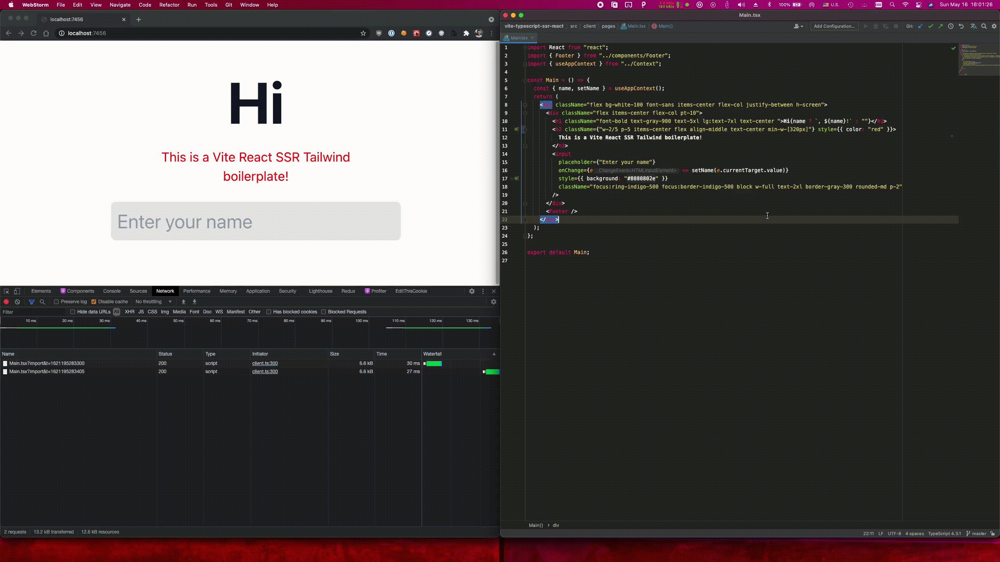

# Transcription Validation Tool

<!-- [](https://github.com/jonluca/vite-typescript-ssr-react/actions/workflows/nodejs.yml) -->

A **blazingly modern, full-stack web application** for highly efficient, human-in-the-loop validation of structured data against original documents. Perfect for refining OCR output, transcribing scanned forms, or any task requiring precise data correction!

<!-- 
*(Above: A quick demo showing the intuitive UI in action!)* -->

## 🚀 What Does It Do?

This tool empowers users to **validate and edit JSON data records side-by-side with their corresponding PDF documents.** Imagine your business needs to extract information from countless invoices, receipts, or forms. This tool provides the critical human touch to ensure data accuracy before it enters your systems.

**Key Use Cases:**

* **OCR Correction:** Review and correct data extracted by Optical Character Recognition (OCR) systems.
* **Manual Transcription:** Transcribe data from scanned documents directly into a structured format.
* **Data Quality Assurance:** Verify and clean datasets against original source material.

## ✨ Core Features

* **Interactive UI**: A clean, split-pane interface showing the PDF on one side and editable data fields on the other.
* **Real-time Autosave**: Never lose your work! All changes are debounced and automatically saved to an "in-progress" state.
* **Comprehensive Undo/Redo**: Full history tracking for all your data edits within a file session.
* **Field-Level Revert**: Easily reset any individual field back to its original value from the source document.
* **Dynamic Field Management**: Add custom fields to your records on the fly, adapting to diverse data needs.
* **Effortless PDF Navigation**: Pan and zoom within PDF documents to focus on details. PDFs auto-fit to width on load for optimal viewing.
* **Smart Record Navigation**: Move between records with dedicated buttons or lightning-fast keyboard shortcuts (`ArrowRight`, `ArrowLeft`, `Enter`).
* **Streamlined Workflow**: "Commit" a file to mark it as validated, and the tool intelligently suggests the next file needing attention.
* **Persistent Progress**: Your last viewed record and any "soft-validated" records are remembered, so you can always pick up exactly where you left off.
* **Robust Data Management**: Clear separation of `source`, `in_progress`, and `validated` data directories on the server.

## 💻 Technology Highlights

This project is built on a cutting-edge web stack designed for performance, maintainability, and developer experience:

* **Frontend**:
  * **React 18**: Modern, efficient UI.
  * **TypeScript**: Type safety and better code quality.
  * **Tailwind CSS**: Utility-first CSS framework for rapid styling.
* **Backend**:
  * **Node.js**: Powerful JavaScript runtime.
  * **Express**: Fast, unopinionated web framework.
* **Build & Dev Tools**:
  * **Vite**: Blazing fast development server and build tool.
  * **Vite SSR**: Server-Side Rendering for improved initial load performance and SEO.
* **Testing**:
  * **Vitest**: Modern, fast test framework.
  * **React Testing Library**: For robust UI testing.
  * **MSW (Mock Service Worker)**: Seamless API mocking for reliable tests.
* **CI/CD**:
  * **GitHub Actions**: Automated testing and building on every push and pull request.

## 🚀 Get Started (For Developers)

1. **Clone the repository:**

    ```bash
    git clone https://github.com/jonluca/vite-typescript-ssr-react.git
    cd vite-typescript-ssr-react
    ```

2. **Install dependencies:**

    ```bash
    pnpm install
    ```

3. **Run in development mode (with SSR and API):**

    ```bash
    pnpm dev:server
    # Server will start on http://localhost:7456
    ```

    (Or `pnpm dev:client` for client-only UI development)

4. **Build for production:**

    ```bash
    pnpm build
    ```

5. **Serve production build:**

    ```bash
    pnpm serve
    ```

**To use the tool:**

1. Place your JSON data files (each containing an array of records) into the `data_source/` directory.
2. Ensure each record in your JSON includes a `source` field pointing to a PDF filename (e.g., `"source": "my_document.pdf"`).
3. Place the corresponding PDF files into `dagster_card_processor/cards_to_process/` (or adjust the static file serving path in `server.ts`).
4. Navigate to `http://localhost:7456` and start validating!

## 🤝 Contributing

We welcome contributions! If you find a bug, have a feature request, or want to contribute code, please check out our [GitHub Issues](https://github.com/jonluca/vite-typescript-ssr-react/issues) and [Contributing Guidelines](https://github.com/jonluca/vite-typescript-ssr-react/blob/main/CONTRIBUTING.md).

## 📜 License

This project is open-source and available under the [MIT License](https://github.com/jonluca/vite-typescript-ssr-react/blob/main/LICENSE).
